# System Architecture

## Overview

The GenAI Workflow Starter is designed as a modular, extensible system for building AI-powered applications with multiple agents. The architecture follows a layered approach with clear separation of concerns.

## High-Level Architecture

```mermaid
flowchart TB
    subgraph "Client Layer"
        WEB["🌐 Web Interface"]
        API_CLIENT["📱 API Client"]
    end

    subgraph "API Layer"
        FASTAPI["⚡ FastAPI Server"]
        ROUTES["🛣️ API Routes"]
        MIDDLEWARE["🔧 Middleware"]
    end

    subgraph "Agent System"
        GRAPH["🔀 Agent Graph"]
        CHAT["💬 Chat Agent"]
        RAG["🔍 RAG Agent"]
        TOOLS["🛠️ Tool Registry"]
    end

    subgraph "Data Layer"
        VECTOR["📊 Vector Store"]
        CACHE["⚡ Redis Cache"]
        CONFIG["⚙️ Configuration"]
    end

    subgraph "External Services"
        LLM["🤖 LLM Provider"]
        EMBEDDINGS["🔢 Embeddings"]
    end

    WEB --> FASTAPI
    API_CLIENT --> FASTAPI
    FASTAPI --> ROUTES
    ROUTES --> MIDDLEWARE
    MIDDLEWARE --> GRAPH
    GRAPH --> CHAT
    GRAPH --> RAG
    CHAT --> TOOLS
    RAG --> TOOLS
    RAG --> VECTOR
    GRAPH --> CACHE
    TOOLS --> LLM
    RAG --> EMBEDDINGS
    VECTOR --> EMBEDDINGS
```



## Component Details

### API Layer

- **FastAPI Server**: High-performance async web framework
- **API Routes**: RESTful endpoints for agent interactions
- **Middleware**: Authentication, CORS, logging, and error handling

### Agent System

- **Agent Graph**: Orchestrates multiple agents using LangGraph
- **Chat Agent**: Handles conversational interactions
- **RAG Agent**: Retrieval-Augmented Generation for document queries
- **Tool Registry**: Extensible system for agent capabilities

### Data Layer

- **Vector Store**: Stores document embeddings for RAG
- **Redis Cache**: Fast caching for API responses and session data
- **Configuration**: Environment-based configuration management

## Key Design Patterns

### 1. Agent Pattern

```python
class BaseAgent:
    def invoke(self, input_data: Dict) -> Dict:
        # Standard agent interface
        pass
```

### 2. Graph-Based Orchestration

- Agents are nodes in a directed graph
- Conditional routing based on input types
- State management across agent interactions

### 3. Tool System

```python
@tool
def custom_tool(query: str) -> str:
    """Custom tool implementation"""
    return result
```

## Data Flow

1. **Request**: Client sends request to API
2. **Routing**: API routes to appropriate handler
3. **Agent Selection**: Graph determines which agent(s) to use
4. **Processing**: Agent processes request using tools
5. **Response**: Result returned to client

## Scalability Considerations

- **Horizontal Scaling**: Stateless API servers
- **Caching Strategy**: Redis for session and response caching
- **Async Processing**: FastAPI + async/await throughout
- **Resource Management**: Connection pooling and rate limiting

## Security Architecture

- Environment-based configuration
- API key management for external services
- Input validation and sanitization
- CORS configuration for web clients

## Development Environment

```mermaid
flowchart LR
    DEV["👨‍💻 Developer"]
    HOT["🔥 Hot Reload"]
    API["🔗 Local API"]
    TOOLS["🛠️ Dev Tools"]
    
    DEV --> HOT
    HOT --> API
    API --> TOOLS
    TOOLS --> DEV
```



## Deployment Architecture

- **Containerization**: Docker for consistent environments
- **Process Management**: Multiple worker processes
- **Monitoring**: Health checks and logging
- **Configuration**: Environment variables and secrets

## Extension Points

1. **New Agents**: Implement BaseAgent interface
2. **Custom Tools**: Use @tool decorator
3. **Middleware**: Add to FastAPI middleware stack
4. **Data Sources**: Extend vector store implementations

## Technology Stack

- **Backend**: Python, FastAPI, LangChain, LangGraph
- **AI/ML**: OpenAI GPT, Embeddings APIs
- **Data**: Vector databases, Redis
- **Infrastructure**: Docker, environment configuration

This architecture provides a solid foundation for building and scaling AI-powered applications while maintaining modularity and extensibility.
